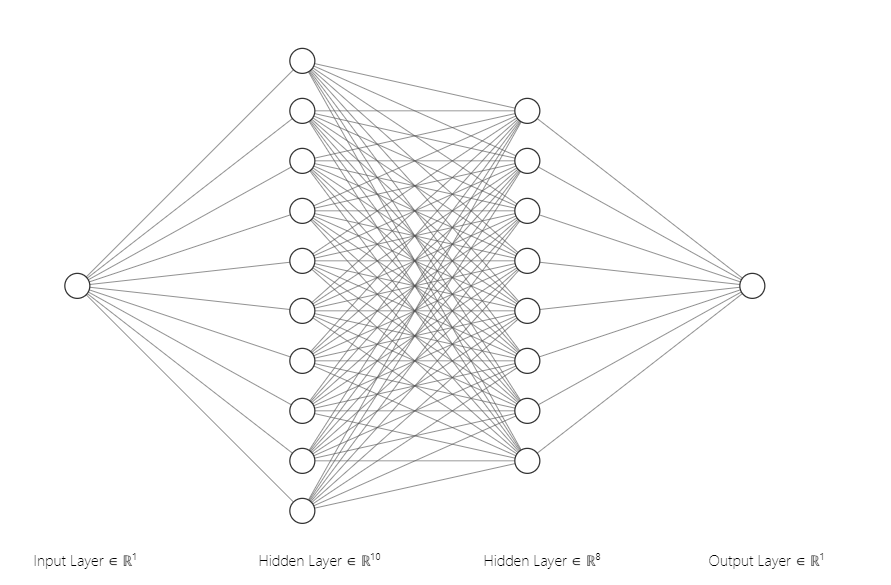
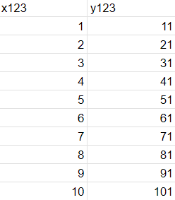
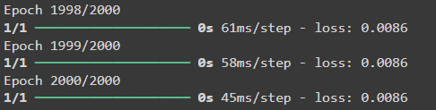
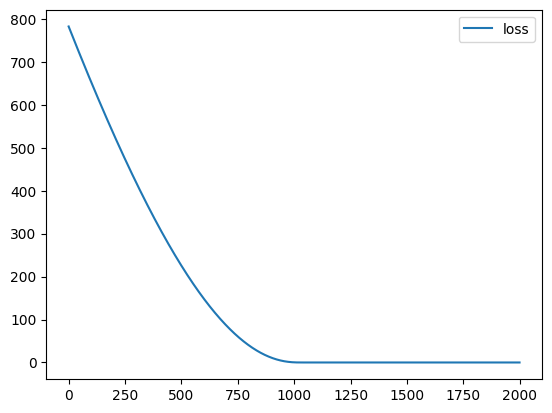
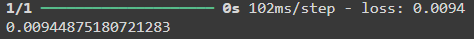

# Developing a Neural Network Regression Model

## AIM

To develop a neural network regression model for the given dataset.

## THEORY
Neural network regression is a supervised learning method, and therefore requires a tagged dataset, which includes a label column. Because a regression model predicts a numerical value, the label column must be a numerical data type. A neural network regression model uses interconnected layers of artificial neurons to learn the mapping between input features and a continuous target variable. It leverages activation functions like ReLU to capture non-linear relationships beyond simple linear trends. Training involves minimizing the loss function (e.g., Mean Squared Error) through an optimizer (e.g., Gradient Descent). Regularization techniques like L1/L2 and dropout prevent overfitting. This approach offers flexibility and high accuracy for complex regression problems.

## Neural Network Model


## DESIGN STEPS

### STEP 1:

Loading the dataset

### STEP 2:

Split the dataset into training and testing

### STEP 3:

Create MinMaxScalar objects ,fit the model and transform the data.

### STEP 4:

Build the Neural Network Model and compile the model.

### STEP 5:

Train the model with the training data.

### STEP 6:

Plot the performance plot

### STEP 7:

Evaluate the model with the testing data.

## PROGRAM
### Name:
### Register Number:
```python
import pandas as pd
from sklearn.model_selection import train_test_split
from sklearn.preprocessing import MinMaxScaler

from tensorflow.keras.models import Sequential
from tensorflow.keras.layers import Dense
from google.colab import auth
import gspread
from google.auth import default

auth.authenticate_user()
creds, _ = default()
gc = gspread.authorize(creds)

worksheet=gc.open('DL1').sheet1
data1=worksheet.get_all_values()

dataset1=pd.DataFrame(data1[1:],columns=data1[0])
dataset1=dataset1.astype({'x123':'float'})
dataset1=dataset1.astype({'y123':'float'})

X12=dataset1[['x123']].values
y12=dataset1[['y123']].values

x_train1,x_test1,y_train1,y_test1=train_test_split(X12,y12,test_size=0.33,random_state=43)

print("Shape of x_train1:",x_train1.shape)
print("Shape of y_train:", y_train1.shape)

scaler=MinMaxScaler()

scaler.fit(x_train1)

x_train1=scaler.transform(x_train1)

ai_model=Sequential([
    Dense(8,activation='relu',input_shape=[1]),
    Dense(10,activation='relu'),
    Dense(1)
])

ai_model.compile(optimizer='rmsprop',loss='mse')

ai_model.fit(x_train1,y_train1,epochs=2000)

loss_df=pd.DataFrame(ai_model.history.history)
loss_df.plot()

x_test1=scaler.transform(x_test1)

ai_model.evaluate(x_test1,y_test1)

x_n1=[[6]]

x_n1_1=scaler.transform(x_n1)

ai_model.predict(x_n1_1)

```
## Dataset Information


## OUTPUT

### Training Loss Vs Iteration Plot



### Test Data Root Mean Squared Error



### New Sample Data Prediction


## RESULT

Thus the neural network regression model for the given dataset is developed successfully!
